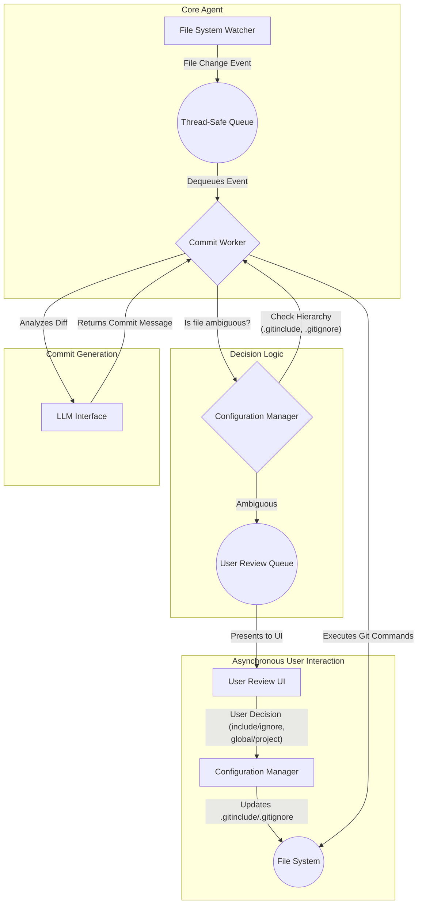

# System Design: auto-commit Agent

## 1. Introduction

This document provides the high-level system design for the `auto-commit` agent. It describes the architecture, components, and technology stack that will be used to meet the specifications outlined in `REQUIREMENTS.md`.

## 2. High-Level Architecture

The system is designed as a modular, event-driven agent. The architecture is centered around a `File System Watcher` that feeds events into a `Queue`. A pool of `Commit Workers` process these events, but now with a more sophisticated decision-making process involving a new `Configuration Manager` and a `User Review Subsystem` for handling ambiguities.

## 3. Component Breakdown

### 3.1. File System Watcher
- **Technology**: Python's `watchdog` library.
- **Responsibility**: Monitors the configured directories for any file changes (creation, deletion, modification). When a change is detected, it creates a `FileChangeEvent` object and places it onto the central `Thread-Safe Queue`.

### 3.2. Thread-Safe Queue
- **Technology**: Python's `queue.Queue`.
- **Responsibility**: Acts as a buffer between the watcher and the workers, ensuring that file events are processed sequentially and that the system can handle bursts of activity.

### 3.3. Commit Worker
- **Technology**: A pool of Python threads.
- **Responsibility**: This is the core logic engine. Each worker:
    1. Dequeues a `FileChangeEvent`.
    2. For new files, it queries the `Configuration Manager` to determine the file's status (include, ignore, or ambiguous).
    3. If ambiguous, it sends the file information to the `User Review Subsystem` and stops processing for that event.
    4. If the file should be ignored, it takes no further action.
    5. If the file should be included, it ensures the project's `.gitignore` is updated if necessary (per REQ-F-08).
    6. It stages the changes (`git add`).
    7. It invokes the `LLM Interface` to generate a commit message.
    8. It performs the commit (`git commit`).

### 3.4. Configuration Manager
- **Technology**: A dedicated Python class.
- **Responsibility**:
    - Manages the reading and writing of global and project-specific `.gitinclude` and `.gitignore` files.
    - Provides a clear interface for the `Commit Worker` to check a file path against the include/ignore hierarchy.
    - Persists decisions made by the user in the `User Review UI`.

### 3.5. User Review Subsystem
- **Technology**: A combination of a persistent queue (e.g., a simple SQLite DB) and a lightweight web-based UI (e.g., using Flask or FastAPI).
- **Responsibility**:
    - Stores ambiguous files that require user input.
    - Renders a simple UI for the user to review these files.
    - Forwards the user's decisions back to the `Configuration Manager`.

### 3.6. LLM Interface
- **Technology**: A dedicated Python class (`LLMCommitGenerator`).
- **Responsibility**: Abstracts all interaction with the LLM. It will construct the prompt, handle API requests to the local Docker container, parse the response, and manage errors and retries.

## 4. Technology Stack
- **Language**: Python 3.9+
- **File Monitoring**: `watchdog`
- **Git Interaction**: `gitpython` library
- **UI for Review**: Flask or FastAPI (to be determined)
- **Dependencies**: To be managed via `requirements.txt`.

## 5. Error Handling and Fallback
- **Watcher Errors**: The watcher will log any errors during monitoring but will attempt to continue running.
- **Worker Errors**: If a worker fails to process a commit due to a Git or file system error, it will log the issue and move the event to a failed queue for later inspection.
- **LLM Failure Fallback**: If the primary local LLM is unresponsive after multiple retries, the system will use the cross-project Linear workflow as a backup. It will create an issue in a designated Linear project, containing the diff and a request for a commit message. It will then poll for a response before proceeding. 