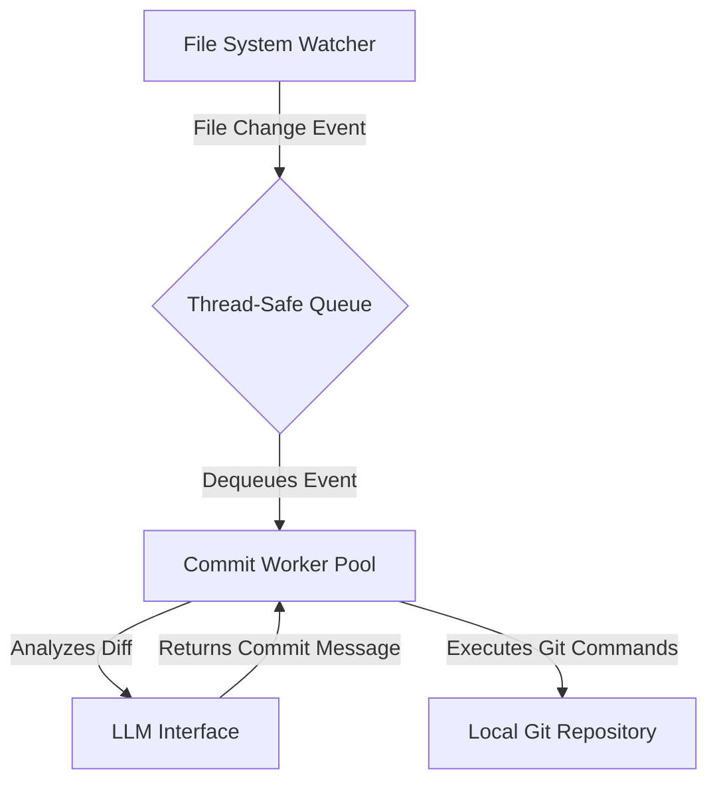

# System Design: auto-commit Agent

## 1. Introduction

This document provides the high-level system design for the `auto-commit` agent. It describes the architecture, components, and technology stack that will be used to meet the specifications outlined in `REQUIREMENTS.md`.

## 2. High-Level Architecture

The system is designed as a modular, event-driven agent. The primary components are a File System Watcher, a central thread-safe Queue, and a pool of Commit Workers. This decouples file change detection from the processing logic, allowing for scalability and resilience.

## 3. Component Breakdown

### 3.1. File System Watcher
- **Technology**: Python's `watchdog` library.
- **Responsibility**: Monitors directories specified in `config.json`. On detecting a change, it creates a `FileChangeEvent` object and places it onto the central queue. It will run in its own dedicated thread.

### 3.2. Thread-Safe Queue
- **Technology**: Python's built-in `queue.Queue`.
- **Responsibility**: Acts as a buffer between the watcher and the workers. This ensures that file change events are processed sequentially and that no events are lost if the workers are busy.

### 3.3. Commit Worker Pool
- **Technology**: Python's `threading` module.
- **Responsibility**: A pool of one or more worker threads that continuously consume events from the queue. Each worker is responsible for the entire commit lifecycle for a given change event: initializing the repo (if needed), calling the LLM interface, and executing the Git commands.

### 3.4. LLM Interface
- **Technology**: A dedicated Python class (`LLMCommitGenerator`).
- **Responsibility**: Abstracts all interaction with the LLM. It will construct the prompt, handle API requests to the local Docker container, parse the response, and manage errors and retries.

### 3.5. Data Models
- **`FileChangeEvent`**: A simple data object containing information about the file change, such as `event_type` (created, modified, deleted) and `file_path`.

## 4. Technology Stack

- **Language**: Python 3.9+
- **Libraries**:
  - `watchdog`: For file system monitoring.
  - `GitPython`: For a programmatic interface to Git repositories.
  - Standard libraries: `threading`, `queue`, `subprocess` (for `curl`), `json`.

## 5. Error Handling Strategy

- **Watcher Errors**: The watcher will log any errors during monitoring but will attempt to continue running.
- **Worker Errors**: If a worker fails to process a commit due to a Git or file system error, it will log the issue and move the event to a failed queue for later inspection.
- **LLM Failure Fallback**: If the primary local LLM is unresponsive after multiple retries, the system will not use an external service. Instead, it will create a new high-priority issue in the "Project Catalog" Linear project. This issue will contain the `diff` and a request for a commit message. The agent will then periodically check for this issue to be resolved, retrieving the commit message from the issue description or comments once it is available. This maintains data privacy and follows a modular, asynchronous pattern. 